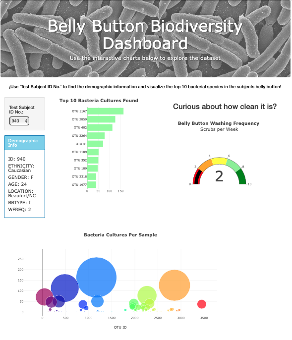

# Bacterial World 

Interactive dashboard made on a website to display volunteers information about their top 10 belly button bacterial species identified.

Website could be accessed through github pages in the following link:

https://albertoaignr.github.io/Improbable-Beef/

## Preview

This picture represents how the webpage should look like a side to select volunteers number with some information about them followed by different visualizations, such as: bar chart, gauge char and bubble chart.

